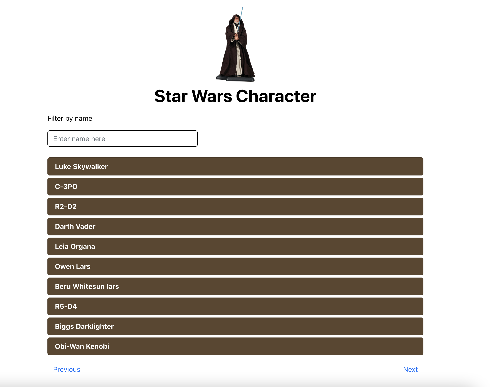

# React SWAPI

A demo react application integrated with https://swapi.dev/.

### Installation

Clone the repo locally:\
`git clone https://github.com/angelicatanagras/swapi-react.git`\
`cd swapi-react`

Build assets:\
`npm install`

Run the dev server (the output will give the address):\
`npm start`

You're ready to go! Visit the app in your browser!
